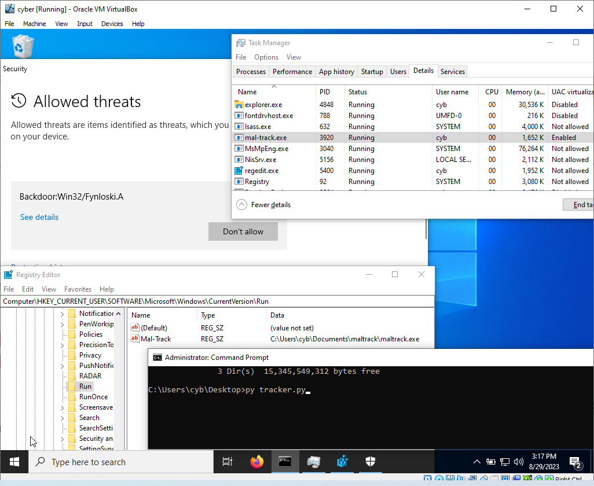
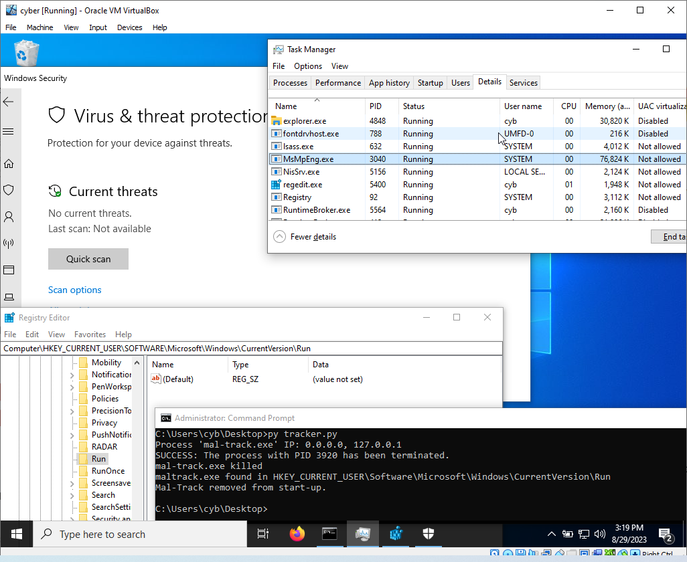

# Mal-Track

This script is designed to detect and remove a specific malware executable from a Windows system. It performs the following actions:

1. **Kill Malware Process:** It checks for the presence of a specified malware process in the system. If found, it terminates the process and displays any associated IP addresses.

2. **Delete Registry Entries:** It searches for registry entries that include references to the malware executable in startup locations. If found, it removes these registry entries.

## Prerequisites

- Have a VM of windows.
- Python 3.x must be installed on the VM.
- Have the mal-track.exe on the VM.

## Usage

1. Make exception in the folder mal-track.exe is located.

2. Run mal-track.exe.

  

3. Run the script by executing the following command:

   ```
   py tracker.py
   ```

4. The script will perform the following steps:
   - Check for the malware process and terminate it.
   - Search for and remove registry entries pointing to the malware executable.

  

## Script Details

The script performs the following tasks:

- Imports required modules for interacting with the Windows operating system.
- Specifies the names of the malware executable and its alternative name.
- Defines registry paths and keys for scanning startup locations.
- Defines functions for killing the malware process and deleting associated registry entries.
- Executes the functions if the script is run directly.

Please note that this script is provided for educational purposes and is intended to assist in understanding malware detection and removal techniques. It should only be used responsibly and with proper authorization.

## Disclaimer

This script is provided as-is without any warranties. The authors are not responsible for any misuse or damage caused by using this script.

**Use at your own risk.**